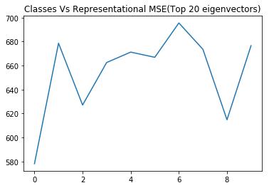
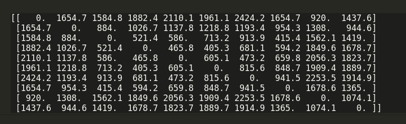

# Multiclass classification
## Representation and Similarity Measures 

### Dataset: `CIFAR-10` (32*32 images divided into 10 categories)

### Representational error
For each category the top 20 eigenvectors of the data covariance matrix are calculated. The images are represented using these eigenvectors and projected into a reduced space. 
The error resulting from representing images of each category using these vectors is calculated and plotted.

### Similarity of classes
#### Distance between means
The similarity of 2 classes can be computed by calculating the distance between their mean images.
More distance corresponds to lesser similarity and vice versa. Distance function used : 2-norm.

#### Similarity through representational measures
Another measure of similarity between two classes A and B can be defined as :
`sim(A,B) = 1/2( E(A->B)+E(B->A)))`
where,`E(A->B)` is defined as the average error obtained by representing all images of class A using the mean of class A and the first 20 principal components of class B.
This is the list of the 3 most similar classes for each class in the dataset obtained from this similarity measure. 

For class 0 ,similar classes: [8 2 4]  
For class 1 ,similar classes: [0 8 2] 
For class 2 ,similar classes: [0 8 3] 
For class 3 ,similar classes: [0 8 2] 
For class 4 ,similar classes: [0 8 2] 
For class 5 ,similar classes: [0 8 2] 
For class 6 ,similar classes: [0 8 2] 
For class 7 ,similar classes: [0 8 2] 
For class 8 ,similar classes: [0 2 4] 
For class 9 ,similar classes: [0 8 2]
